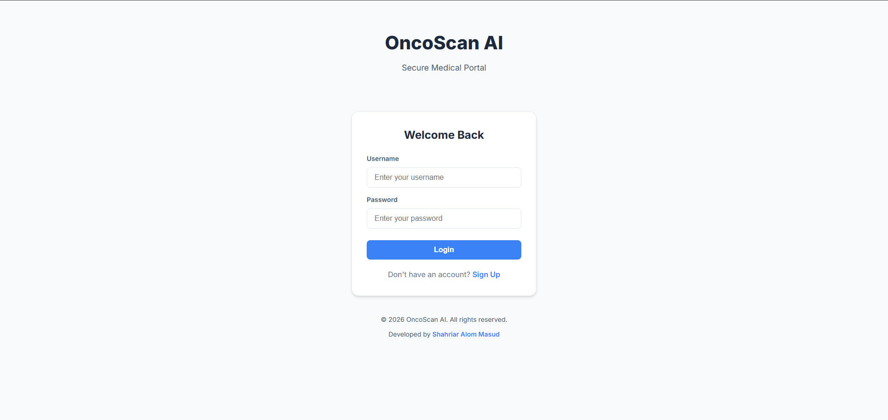
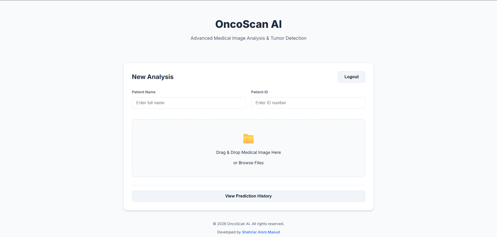
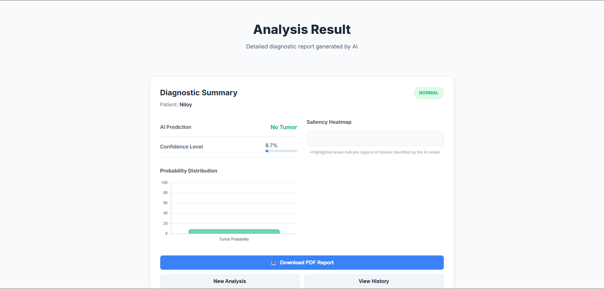
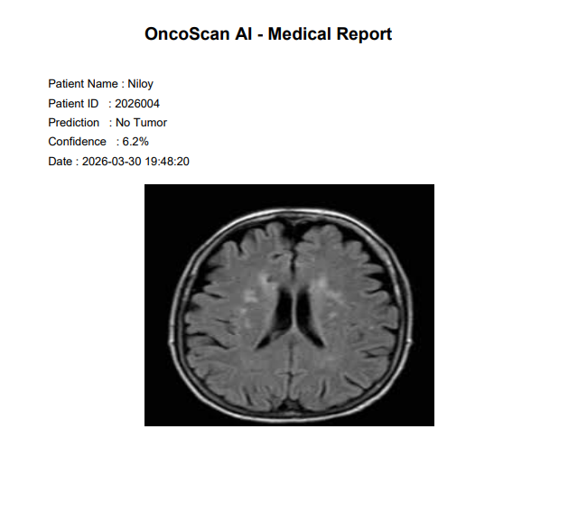
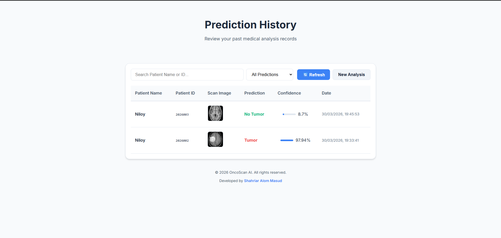
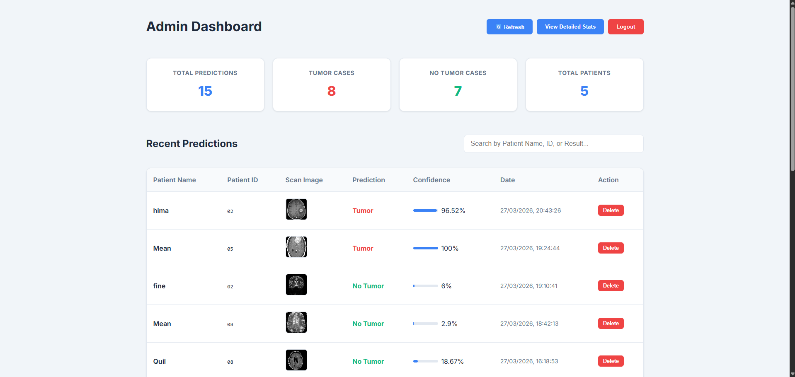
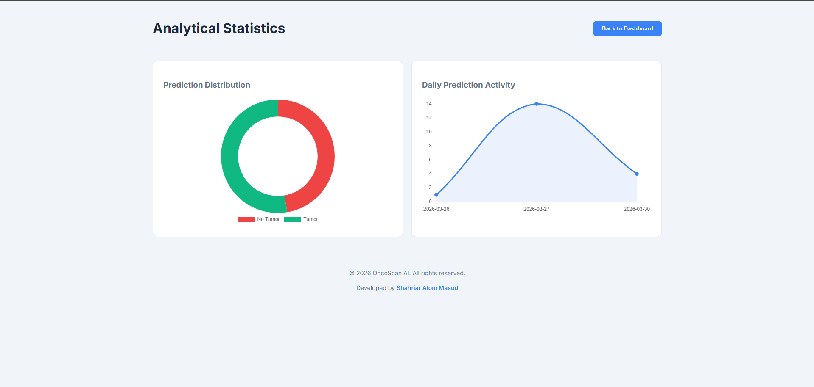

# OncoScan AI: Full Stack Explainable Brain Tumor Detection System Using CNN and Grad-CAM


---

## Project Overview

OncoScan AI is a full-stack explainable artificial intelligence system developed for detecting brain tumors from MRI images using a Convolutional Neural Network (CNN). The system integrates Grad-CAM for heatmap-based explainable AI visualization, a FastAPI backend for prediction and data management, and a web-based frontend interface for user interaction.

The platform also includes PDF medical report generation, prediction history tracking, and an admin analytics dashboard. The frontend is deployed on Netlify and the backend is deployed on Render. The trained deep learning model is optimized and deployed using ONNX Runtime for efficient inference.

This project integrates Machine Learning, Backend Development, Frontend Development, Database Management, REST API Development, and Cloud Deployment into a complete AI-based web platform.

---

## Key Features

- Brain tumor detection from MRI images
- Explainable AI using Grad-CAM heatmaps
- PDF medical report generation
- User authentication system
- Prediction history tracking
- Admin dashboard with analytics
- Charts and statistics visualization
- Cloud deployment (Netlify + Render)
- ONNX optimized model inference
- Full-stack AI web application

---

## Project Motivation

Brain tumor diagnosis using MRI images is a complex and time-consuming process that requires expert radiologists. The goal of this project is to assist medical professionals by developing an AI system that can automatically analyze MRI images and predict whether a tumor is present or not.

The system also provides explainable AI visualization (Grad-CAM heatmap) to show which region of the MRI image influenced the model’s decision.

---

## Dataset Source

The brain MRI dataset used for training the model was collected from publicly available medical imaging datasets and brain MRI tumor classification datasets available on Kaggle and other open research sources.

The dataset contains MRI brain images categorized into:

- Tumor
- No Tumor

---

## Project Structure

```
oncoscan-ai/
│
├── backend/ # FastAPI backend + AI integration
│ ├── main.py # Main FastAPI application
│ ├── database.py # Database connection & queries
│ └── pycache/
│
├── frontend/ # Frontend (Netlify hosted)
│ ├── admin/
│ │ ├── dashboard.html
│ │ ├── dashboard.js
│ │ ├── stats.html
│ │ └── stats.js
│ │
│ ├── user/
│ │ ├── history.html
│ │ └── history.js
│ │
│ ├── index.html # Upload page
│ ├── login.html # Login page
│ ├── result.html # Result page
│ ├── script.js
│ ├── style.css
│ ├── config.js # Backend API URL config
│ └── _redirects # Netlify redirects
│
├── models/ # Machine learning models
│ ├── brain_tumor_model.h5
│ ├── model_fixed.h5
│ ├── model_fixed.keras
│ └── model.onnx # Optimized ONNX model
│
├── Images/ # README screenshots
│
├── static/ # Uploaded images, heatmaps, PDFs
│ ├── images/
│ ├── heatmaps/
│ └── reports/
│
├── utils/
├── tests/
├── notebooks/
├── results/
│
├── fix_model.py
├── database.db
├── requirements.txt
├── runtime.txt
├── Procfile
├── .gitignore
└── README.md
```

---

## Application Screenshots

## Application Screenshots

### Login Page

<p align="center">
  
</p>

### Main Upload Page

<p align="center">
  
</p>

### Analysis Result Page

<p align="center">
  
</p>

### Medical PDF Report

<p align="center">
  
</p>

### User Prediction History

<p align="center">
  
</p>

### Admin Dashboard

<p align="center">
  
</p>

### Admin Analytical Statistics

<p align="center">
  
</p>

---

## Machine Learning Model

The brain tumor detection model is built using Deep Learning with Convolutional Neural Networks (CNN).

### Model Details

- Model Type: Convolutional Neural Network (CNN)
- Task: Binary Image Classification
- Classes: Tumor / No Tumor
- Framework: TensorFlow / Keras
- Deployment Model: ONNX Runtime
- Image Processing: OpenCV
- Output:
  - Prediction (Tumor / No Tumor)
  - Confidence Score

---

## Model Input Format

| Parameter     | Value     |
| ------------- | --------- |
| Image Size    | 224 x 224 |
| Channels      | RGB       |
| Normalization | 0–1       |
| Format        | JPG / PNG |
| Batch Size    | 1         |

---

## Grad-CAM Heatmap (Explainable AI)

Grad-CAM (Gradient-weighted Class Activation Mapping) is used to visualize which region of the MRI image influenced the model’s prediction.

### Grad-CAM Workflow

Input Image  
↓  
CNN Forward Pass  
↓  
Compute Gradients  
↓  
Generate Heatmap  
↓  
Overlay Heatmap on Image

This makes the AI system explainable and suitable for medical applications.

---

## Backend (FastAPI)

The backend of the system is developed using FastAPI.

### Backend Responsibilities

- User Authentication
- Image Upload Handling
- AI Model Prediction
- Heatmap Generation
- PDF Report Generation
- Database Storage
- Prediction History
- Admin Dashboard APIs
- Statistics and Analytics
- Record Deletion

---

## REST API Endpoints

| Endpoint           | Method | Description                     |
| ------------------ | ------ | ------------------------------- |
| /register          | POST   | User Registration               |
| /login             | POST   | User Login                      |
| /predict           | POST   | Upload image and get prediction |
| /history/{user_id} | GET    | User prediction history         |
| /admin/all-history | GET    | Admin dashboard data            |
| /stats             | GET    | System statistics               |
| /stats-details     | GET    | Chart data                      |
| /delete/{id}       | DELETE | Delete prediction               |
| /report/{id}       | GET    | Download PDF report             |

---

## API Response Example

```json
{
  "prediction": "Tumor",
  "confidence": 97.94,
  "heatmap": "static/heatmaps/heatmap_12.png",
  "report": "static/reports/report_12.pdf"
}
```

---

## Database (SQLite)

The system uses SQLite database to store user accounts and prediction records.

### Users Table

| Field      | Description           |
| ---------- | --------------------- |
| id         | User ID               |
| username   | Username              |
| password   | Password              |
| role       | user / admin          |
| created_at | Account creation date |

### Predictions Table

| Field        | Description        |
| ------------ | ------------------ |
| id           | Prediction ID      |
| user_id      | User ID            |
| patient_name | Patient Name       |
| patient_id   | Patient ID         |
| image_path   | Uploaded MRI image |
| prediction   | Tumor / No Tumor   |
| confidence   | Confidence score   |
| heatmap_path | Heatmap image      |
| report_path  | PDF report         |
| date         | Prediction date    |

### Relationship

One User → Many Predictions

## Frontend

The frontend of the system is built using HTML, CSS, and JavaScript.

### User Features

- User Registration
- User Login
- Upload MRI Image
- Drag and Drop Image Upload
- Image Preview
- Tumor Prediction Result
- Confidence Score Display
- Heatmap Visualization
- PDF Report Download
- Prediction History

### Admin Features

- Admin Dashboard
- Total Predictions
- Tumor Cases Count
- No Tumor Cases Count
- Total Patients
- Recent Predictions Table
- Delete Prediction Records
- Analytics Charts

---

## Charts and Analytics

Charts are implemented using Chart.js.

Charts included:

- Prediction Distribution (Pie Chart)
- Daily Prediction Activity (Line Chart)

---

## System Architecture

User (Browser)
|
v
Frontend (HTML, CSS, JavaScript)
|
v
Netlify (Frontend Hosting)
|
v
FastAPI Backend (Render)
|
v
ONNX Runtime
|
v
AI Model (model.onnx)
|
v
Database (SQLite)

---

## ONNX Optimization

The trained TensorFlow/Keras model was converted to ONNX format to improve deployment performance and reduce dependency issues on cloud platforms like Render.

Benefits of ONNX:

Faster inference
Lower memory usage
No TensorFlow dependency on server
Better deployment compatibility
Smaller runtime environment

---

## Deployment

| Component       | Platform     |
| --------------- | ------------ |
| Frontend        | Netlify      |
| Backend         | Render       |
| Database        | SQLite       |
| AI Model        | ONNX Runtime |
| Version Control | GitHub       |

---

## Run Locally

git clone https://github.com/masud744/oncoscan-ai
cd oncoscan-ai
python -m venv venv
venv\Scripts\activate
pip install -r requirements.txt
uvicorn backend.main:app --reload

---

## Environment Variables

Create a .env file:
DATABASE_URL=sqlite:///database.db
MODEL_PATH=models/model.onnx

---

## Project Workflow

User Login
↓
Upload MRI Image
↓
Image Preprocessing
↓
CNN Model Prediction
↓
Generate Heatmap
↓
Save Data to Database
↓
Generate PDF Report
↓
Show Result to User
↓
Admin Dashboard Analytics

---

## Technologies Used

### Machine Learning

- TensorFlow
- Keras
- CNN
- Grad-CAM
- OpenCV
- ONNX Runtime
- NumPy

### Backend

- FastAPI
- Python
- SQLite
- ReportLab
- Uvicorn

### Frontend

- HTML
- CSS
- JavaScript
- Chart.js

### Deployment

- Netlify
- Render
- GitHub

---

## Future Improvements

- Password hashing
- Email notification system
- Multiple image prediction
- Cloud image storage
- Model accuracy dashboard
- Docker deployment
- JWT authentication
- Role-based access control
- Mobile responsive UI

---

## Author

Shahriar Alom Masud  
B.Sc. Engg. in IoT & Robotics Engineering  
University of Frontier Technology, Bangladesh  
Email: shahriar0002@std.uftb.ac.bd  
LinkedIn: https://www.linkedin.com/in/shahriar-alom-masud

---

## License

This project is licensed under the **MIT License**.

---

If you like this project, give it a star on GitHub!
